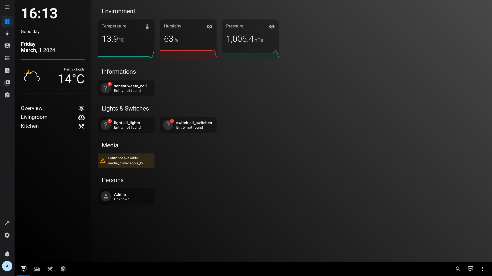
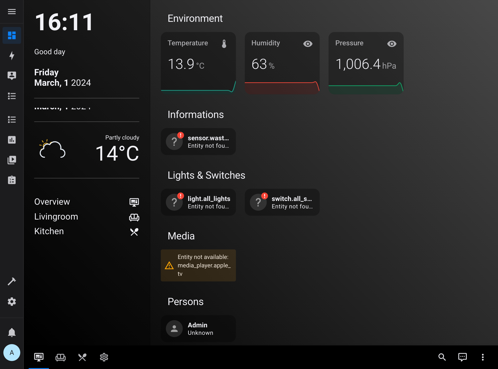
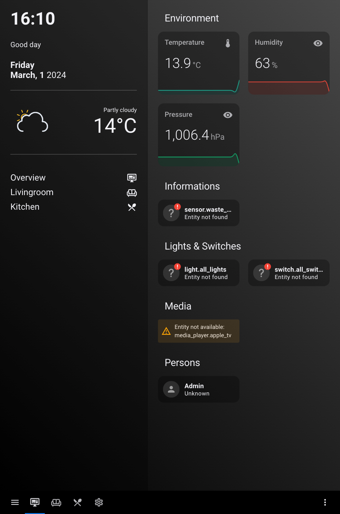

# Home Assistant - Boilerplate Configuration

## Configuration / Dashboard

This is my personal Home Assistant configuration.

## Screenshots

- Desktop

- iPad Landscape/Portrait

For further information see [Wiki](https://github.com/carsten-walther/homeassistant-boilerplate/wiki).
